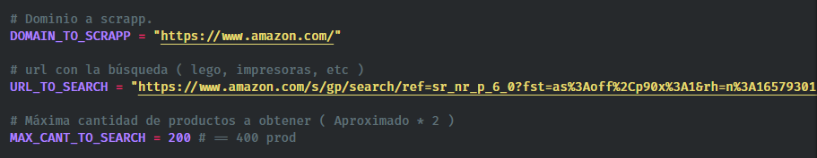

# Amazon Simple Scrapy 

* Python 3.7.1
* Servicio de apoyo Proxy : https://www.proxymesh.com/

# Instalación

```
pip install -r requirements
```

# Configuración del scrapp

nano ./amazon/amazon/settings.py




# Corerr App
```
scrapy crawl amazon -t csv
```